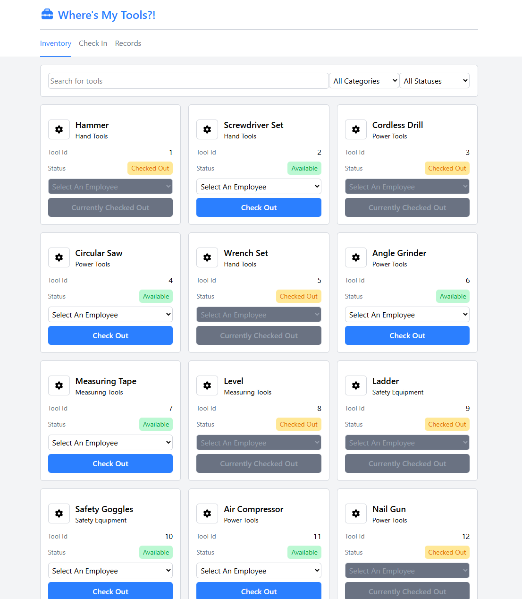
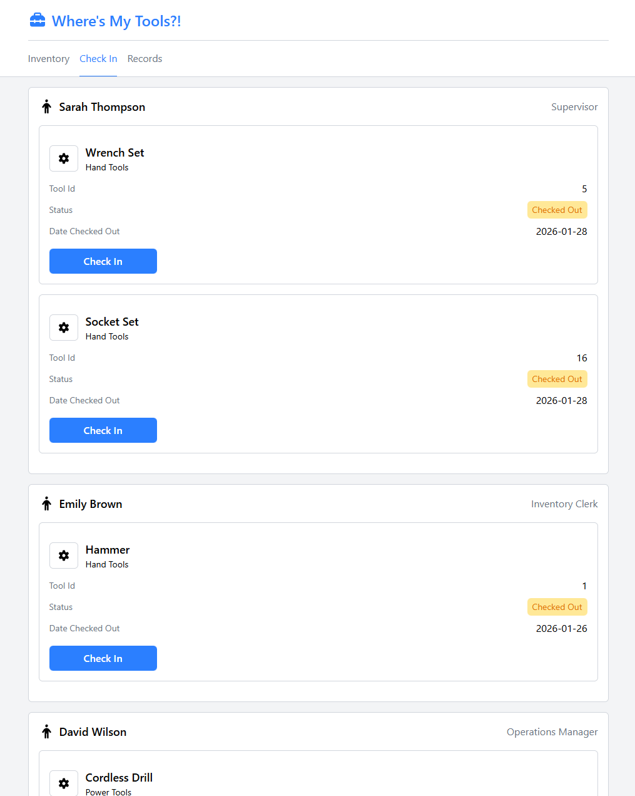
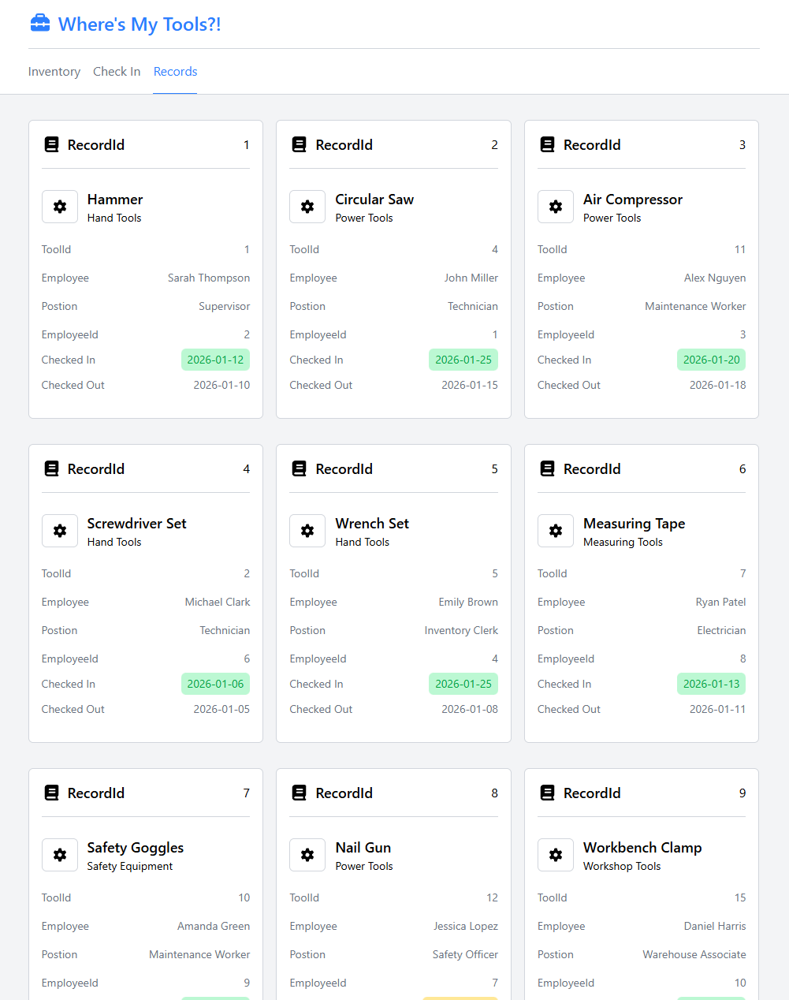

# Where's My Tools?!
An equipment inventory management system designed to track Tools across a worksite. Built with a React frontend and an ASP.NET backend.
## Table of Contents
- [Where's My Tools?!](#wheres-my-tools)
  - [Introduction](#introduction)
  - [Tech Stack](#tech-stack)
  - [Learning Goals](#learning-goals)
  - [Home Page](#home-page)
  - [Check-In Page](#check-in-page)
  - [Records Page](#records-page)
  - [Quick Start Guide](#quick-start-guide)
    - [Prerequisites:](#prerequisites)
    - [Installation \& Setup:](#installation--setup)
      - [Database Configuration:](#database-configuration)
      - [Backend Setup:](#backend-setup)
      - [Frontend Setup:](#frontend-setup)

## Introduction
"Where's My Tools?!" is a full-stack inventory management solution. It allows site managers to monitor tool availability, track which employees are currently using specific tools, and maintain a history of check-in/check-out records.

## Tech Stack
Frontend: React, TypeScript, Tailwind CSS

Backend: ASP.NET Core (REST API), Entity Framework (EF) Core

Database: SQL Server

Tools: Visual Studio, VS Code, SSMS

## Learning Goals
Having previously focused on frontend development, this project served as my deep dive into backend architecture. My objectives were:

- [x] Architect a REST API using ASP.NET Core.

- [x] Database Integration: Connect the API to SQL Server using EF Core (Code First/Database First).

- [x] HTTP Mastery: Implement full CRUD operations (GET, POST, PUT, DELETE).

- [x] Data Consumption: Bridge the gap by populating a React frontend with fetched asynchronous data.

- [x] State Management: Reflect backend changes in the UI immediately upon successful requests.

Reflections: While I successfully implemented the core logic, I recognized the need for more defensive programming and custom server error responses. My next project will be Jira like project management application with a larger database, authorization, and a complex UI.

## Home Page
View what's available.

Browse the full tool inventory and current availability status.

Assign a tool to an employee directly from the dashboard with UI feedback.



## Check-In Page
View a categorized list of employees and the specific tools currently in their possession.

Check tools back into the system to update the inventory.



## Records Page
Access a history of every record, including timestamps, employee names, and tool IDs.



## Quick Start Guide
### Prerequisites:

- Visual Studio (2022 or later) with .NET 9 runtime

- Visual Studio Code

- Node.js & npm

- SQL Server Management Studio (SSMS)

### Installation & Setup:
Clone the Repository:

```bash
git clone https://github.com/SmokeSculpter/WheresMyTools.git
```

#### Database Configuration:

Run the provided SQL script in SSMS to generate tables and insert data.

#### Backend Setup:

1. Open the solution in the RESTApi folder using Visual Studio.
2. Navigate to appsettings.json.
3. Update the ConnectionStrings (Server and Database names) to match what you have locally.
4. Run the project (the API will start on localhost).

#### Frontend Setup:

1. Open the FrontEnd folder in VS Code.
2. Install dependencies and start the dev server:
```bash
npm install
npm run dev
```

You're done! The React application should now be communicating with your local SQL database.
